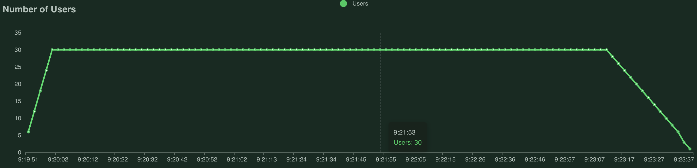
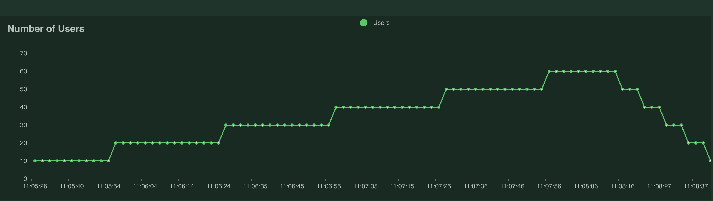
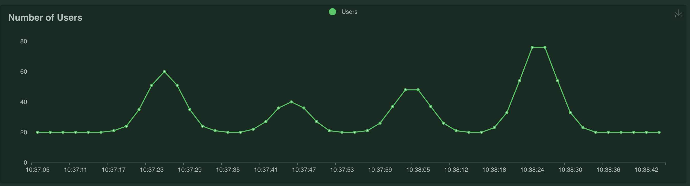
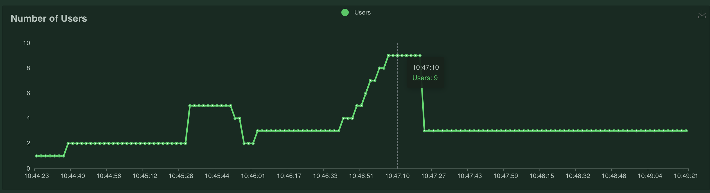
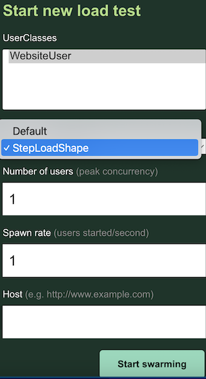

# Locust Templates

This folder contains templates of LoadTestShape classes that can be used to generate more complex curves:

## LoadShape:

This class is created to do a simple endurance or load performance tests.
Remember that we can consider *Load Performance Test* a test that has a "short" duration (30 minutes for example)
and an *Endurance Performance Test* is a test that has a greater duration (8 hours for example). With this class we can play with the ***time_limit*** value to do any of this two types of tests.

Keyword arguments:
		
        total_users -- Total concurrent users to emulate in this test
		spawn_rate  -- Users to start per second at every step.
		time_limit  -- Time limit in seconds before the numbers of users begins to decrease
		shut_dowm   -- Period of time in which the user count will decrease uniformly
				        until the stop of all users.

## StepsShape:

This class increments numbers of users in a staggered way. This class is interesting when doing **Stress Performance Tests** because it allows us to make an analysis of how the target host behaves with a progressive upload of users.

Keyword arguments:
		
        step_time   -- Time between steps
		step_load   -- User increase amount at each step
		spawn_rate  -- Users to stop/start per second at every step
		time_limit  -- Time limit in seconds
		shut_down   -- Period of time in which the user count will decrease uniformly
				        until stop all users.

## MultiWaves:
A class that generates user peaks uniformly in a defined lapse of time.

Keyword arguments:
		
        peaks           -- A list of users in every peak.
		min_users       -- minimum users
		time_limit      -- total length of test

## MultiGroups:

A class that has different user groups that will start run at the same time.

Keyword arguments:
        
    user_groups     -- A list of dicts, each representing a group:
        users           -- Total users count for this group.
        init_delay      -- When this many seconds pass the users starts.
        startup_time    -- Period of time in which the user count will increase uniformly
                                until it reaches the total number of users of this group.
        hold_load_for   -- Duration time that users will hold load since finish startup_time.
        shutdown        -- Period of time in which the user count will decrease uniformly
                                until stop all users for this group.

Keep in mind that this class does the calculations to emulate the number
of users that must be running at that moment, without really looking about the
lifetime of a specific user.

## **Execute this loscust classes**
    
    locust -f class_file.py  --class-picker

and select the class you want to run:

There are more examples in [this link](https://github.com/locustio/locust/tree/master/examples/custom_shape).